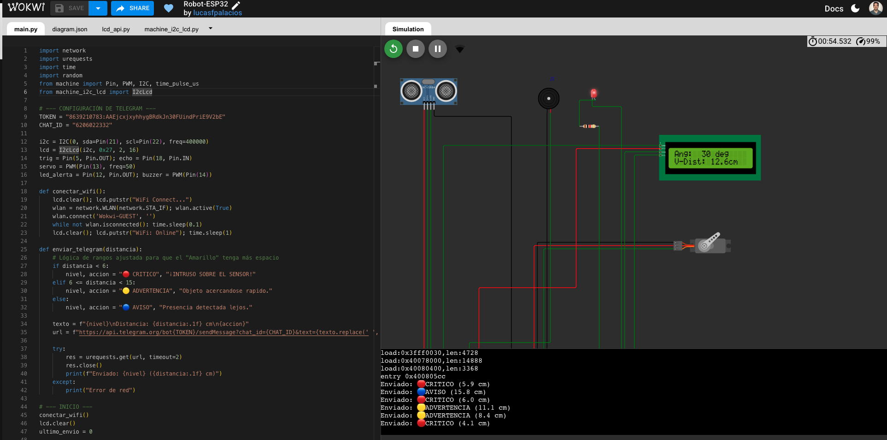

# robotica-esp32-micropython

# 📡 Radar IoT de Seguridad con Alertas Multinivel

Sistema de vigilancia autónomo desarrollado con **ESP32** y **MicroPython**. El dispositivo realiza un escaneo perimetral de 180°, detecta presencia mediante ultrasonido y notifica alertas inteligentes vía **Telegram API**.

## 🗺️ Diagrama del Circuito

> *Captura de pantalla real de los mensajes segmentados por colores y emojis según la proximidad del objeto detectado.*

### 🗺️ Diagrama del Circuito

## 🛠️ Stack Tecnológico
- **Hardware:** ESP32, Sensor HC-SR04, Servo SG90, LCD 16x2 (I2C).
- **Firmware:** MicroPython.
- **Integraciones:** Telegram Bot API (REST), Wi-Fi (Sistemas Embebidos).

## 🧠 Lógica de Alerta Inteligente
El sistema no solo detecta, sino que clasifica el riesgo para reducir la fatiga de alertas:
- **🔵 Nivel Aviso (>15cm):** Presencia detectada en el perímetro.
- **🟡 Nivel Advertencia (6-15cm):** Acercamiento sospechoso.
- **🔴 Nivel Crítico (<6cm):** Intrusión inminente - Alerta máxima.

## 📁 Estructura del Proyecto
- `src/main.py`: Lógica principal, control de periféricos y comunicación Cloud.
- `lib/`: Librerías de terceros para el manejo de protocolos específicos (I2C LCD).

## 🚀 Cómo replicar este proyecto
1. Clonar el repositorio.
2. Configurar el `TOKEN` y `CHAT_ID` en `main.py`.
3. Cargar los archivos a la ESP32 usando Thonny o VS Code (Pymakr).
4. Acceder a la simulación en Wokwi aquí: [[Proyecto de Wokwi](https://wokwi.com/projects/459572819055822849)]
