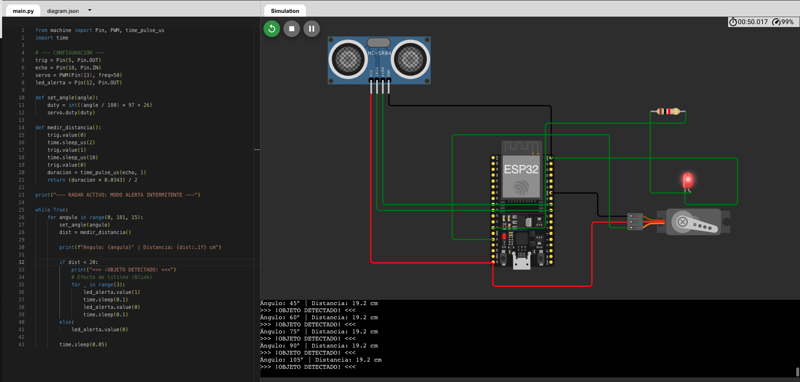

# robotica-esp32-micropython

# Link al proyecto: https://wokwi.com/projects/459572819055822849

# 🤖 Radar de Proximidad con ESP32 y MicroPython

Este proyecto consiste en un sistema de detección de obstáculos automatizado utilizando un microcontrolador **ESP32**. El sistema simula un radar que realiza un barrido de 180° buscando objetos y emite una alerta visual mediante un LED intermitente cuando detecta una proximidad menor a 20 cm.

## 🚀 Características Técnicas
* **Microcontrolador:** ESP32.
* **Lenguaje:** MicroPython.
* **Simulación:** [Wokwi](https://wokwi.com).
* **Protocolos:** PWM para control de servomotor y señales digitales para sensor de ultrasonido.

## 🛠️ Componentes Utilizados
1.  **Sensor HC-SR04:** Sensor de ultrasonido para medir distancias.
2.  **Servomotor SG90:** Encargado de rotar el sensor para ampliar el rango de visión.
3.  **LED de Alerta:** Indicador visual de proximidad crítica.
4.  **Resistencia 220Ω:** Protección para el LED.

## 🔌 Diagrama de Conexiones
| Componente | Pin ESP32 | Función |
| :--- | :--- | :--- |
| **HC-SR04 Trig** | GPIO 5 | Disparo de pulso |
| **HC-SR04 Echo** | GPIO 18 | Recepción de eco |
| **Servo PWM** | GPIO 13 | Control de posición |
| **LED Alerta** | GPIO 12 | Salida digital |

## 💻 Instalación y Uso
1.  Clonar este repositorio.
2.  Importar el archivo `diagram.json` y `main.py` en [Wokwi](https://wokwi.com).
3.  Iniciar la simulación y mover el slider del sensor para probar la detección.

## 🧠 Lógica de Control
El algoritmo principal utiliza un bucle de exploración que mapea ángulos de 0° a 180°. En cada paso, se calcula la distancia mediante la fórmula:

> **Distancia = (Tiempo × 0.0343) / 2**

Si la distancia es inferior al umbral de seguridad, se activa una subrutina de parpadeo (blink) en el LED de alerta.

